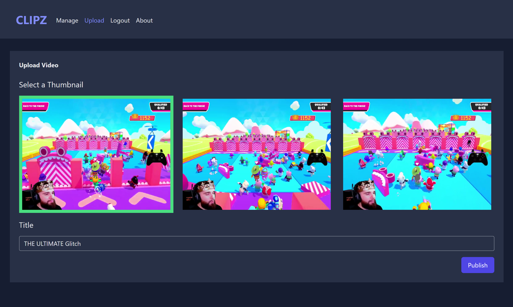

# Clipz

## A website for saving gaming highlights and best shots by gamers 🎮🕹️

Things used in this project:

1. Angular 13.4
2. WebAssembly using **FFmpeg** (For making the processor generates thumbnails from your uploaded clip)
3. **Firbase** (Authentication, Firestore, storage)
4. Advanced **RxJs** operators (combineLatest, forkJoin, switchMap)
5. Advanced Routing Techniques (Resolvers, Interceptors, Guards, Lazy Loading)
6. Reactive Forms Validation including (Async Validators, Input Masking)
7. **SharedArrayBuffer** (that makes shared storage between **Main thread** & **Web worker**)
8. Infinite Scroll (Manually Built)
9. **VideoJs** (For creating nice video player)
10. **Tailwind CSS**

This Application ([Clipz](https://clipz-three.vercel.app/)) has the following pages: 
* Home page contains the latest uploaded clips from users, Authentication Modal
* Clip details page
* About Page 
* After getting authenticated you will be able to visit:
* Manage page to control your uploaded clips (Edit, Delete, Sort)
* Upload page for uploading your clip then selecting your thumbnail, clip title
* 404 Page in case of trying to access unregistered route

|      Home Page       |     Clip Player Page      |
| :------------------: | :-----------------------: |
|  |  |

|    Uploading Page    |
| :------------------: |
|  |
